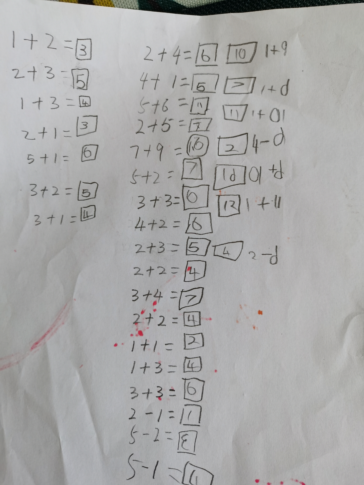

## 小天学会算术题

```html
	这小子可以自己算对10以内加法了，而且能知道自己做的全对。


	PS:
	5周岁的娃，和我们打三国杀，有来有回，记住了几乎所有的基本牌，他用过的武将牌的技能特点。
	而且运气超好，被“杀”的时候总是有“闪”，各种连着摸“无中生有”。
	会观星，空城，反间，改判定......等等，
	用各种延时类锦囊（兵粮寸断，乐不思蜀），
	会用仁王盾，八卦阵，藤甲...
	武器牌记得不太多，很喜欢用诸葛连弩（他老记成诸葛神弩）,
	另外很怕（闪电），从来不挂，有了必（无懈）掉。

```

